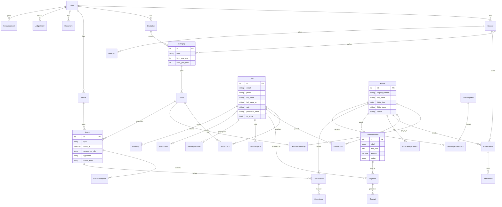

# ERD — WRBH Club Management

## Rôles & permissions (résumé)

| Module | admin | direction | staff | coach | parent |
|--------|-------|-----------|-------|-------|--------|
| Structure club | CRUD | R/W | R | R | — |
| Athlètes / inscriptions | CRUD | CRUD | CRUD | R (équipe) | R (enfants) + inscription |
| Agenda | CRUD | CRUD | CRUD | R/W équipe | R + confirmer convocation |
| Présences | CRUD | R | R | W équipe | R enfants |
| Finance cotisations | CRUD | CRUD | W | — | R enfants |
| Dépenses / paie | CRUD | CRUD | W limité | — | — |
| Inventaire | CRUD | CRUD | W | R | — |
| Annonces / messages | CRUD | CRUD | W | W | W fils |
| Audit | R | R | — | — | — |
